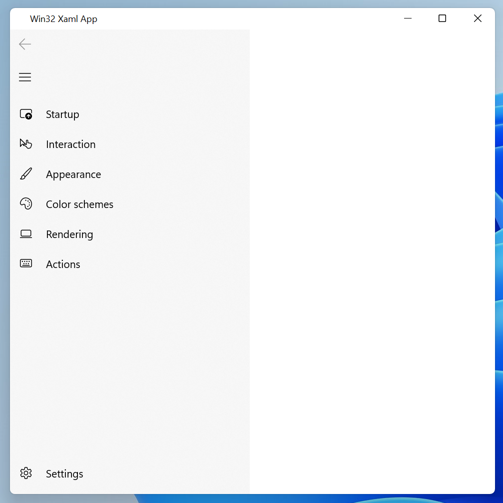
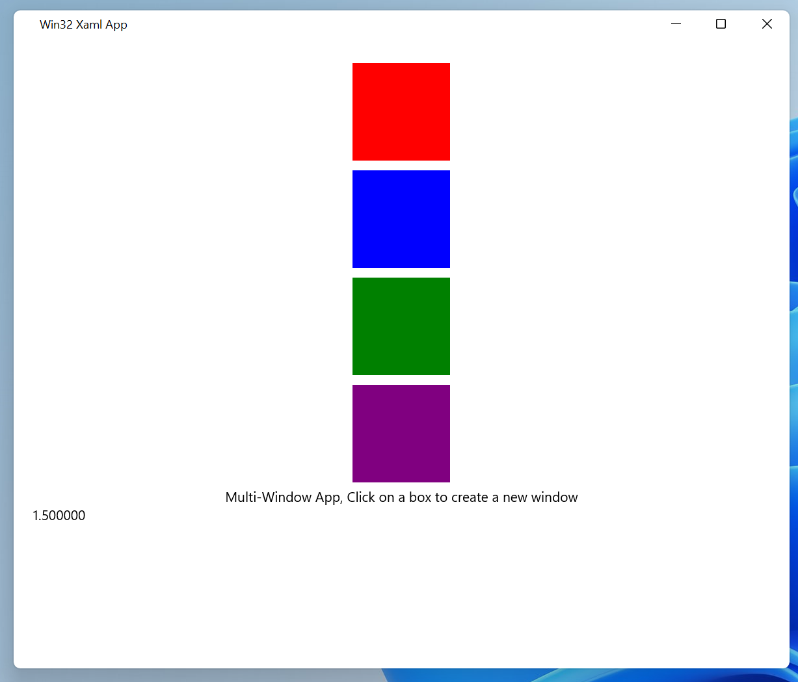

# Win32 Xaml App Samples
C++ samples that demonstrate basic Win32 use of Xaml using [DesktopWindowXamlSource](https://docs.microsoft.com/en-us/uwp/api/windows.ui.xaml.hosting.desktopwindowxamlsource?view=winrt-20348), also known
as Xaml Islands.

* [Minimal](./Minimal/Win32XamlApp.cpp) - The app client area is all Xaml. The markup is stored as a string and parsed at runtime. 
Less that 150 lines of code with 50 of it being markup (the `NavigationView` stolen from Terminals Settings UI)

* [Multi Window App ](./MultiWindow/MultiWindowXamlApp.cpp) - A multi-window Win32 app that uses Xaml. This hooks up some 
handlers to the markups contents to demonstrate responding to Xaml originated events.

* [Multi Xaml Mulit Window App](./MultiXamlAndWindow/MultiXamlAndWindowApp.cpp) - Multi window app that creates 2 islands in each window. Mostly a diagnostic case for testing.

## Limitations
* Not using WinUI 2.x, using System Xaml instead.
* Does not implement accelerator handling or any integration with Win32 UI (who wants to use Win32 UI anyway!).
* No Xaml Application object, so no way to provide custom metadata.
* Intellisense in the .xaml files is broken, VS is confused seeing a .xaml file in a Win32 app project type.

## Debugging tips
Look in the debugger output window for Xaml parsing errors, it identifies line and offset of the error.

## Speical clone instructions
Be sure to clone this repo with `--recurse-submodules` ([docs with details](http://git-scm.com/book/en/v2/Git-Tools-Submodules#Cloning-a-Project-with-Submodules)). 
Alternatively run `git submodule update --init` to use the Win32AppHelper submodule.

`git clone --recurse-submodules https://github.com/ChrisGuzak/Win32XamlApp.git`

